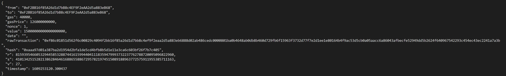

# Ethereum Json Test

Test of json transaction for Ethereum

List of dependencies:

* w3 from web3.auto
* datetime
* json
* sys

# Build

* Install [Python3](https://www.python.org/downloads/)
* Run `pip install web3` or `pip3 install web3` to install web3
* Navigate the terminal to the directory where the script is located using the `$ cd` command.
* Type `python ethereum_json.py` or `python3 ethereum_json.py` in the terminal to execute the script.

# Parameters

Requiered parameters are: ETH amount (first parameter) and destination address (second parameter).
Example: `python ethereum_json.py 15 0xF2BB16f85A26d1d7bB8c4EF9F2eAA2d5a883eB68` 

# Test results

